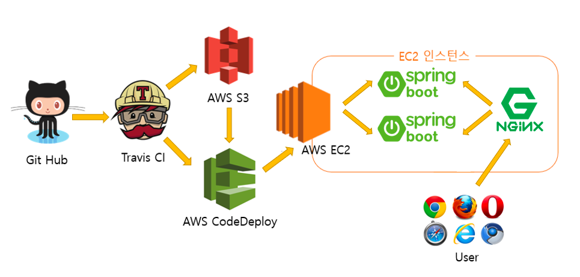
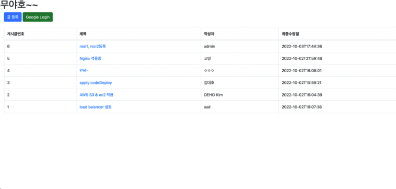
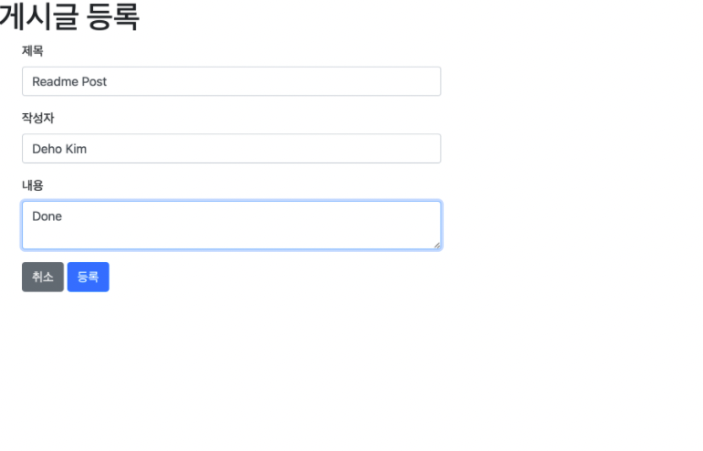
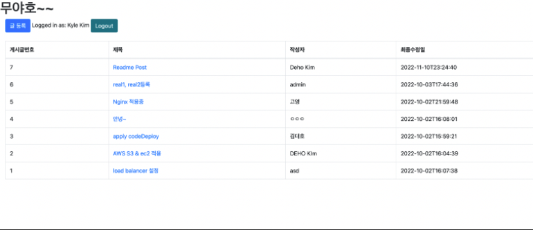

# Todo-App with AWS services

# Introduction
- Superficially, this is a simple todo app that supports adding and removing items from the todo list. The business logic for the service only includes CRUD operations (Create, Read, Update, Delete).
- The primary focus of this project is to utilize and understand various AWS services. Secondly, it aims to deploy these services publicly. Lastly, it emphasizes implementing a 24/7 uninterrupted service using Nginx. 

# Stack 
- Framework: Spring Boot
- DB: H2, 
- Front-end: Mustache(To create dynamic HTML) 
- Spring Security

# 클라우드를 이용한 게시판 페이지

# 게시판 메인 페이지

# 글 등록

# 등록 확인 

# Google Login